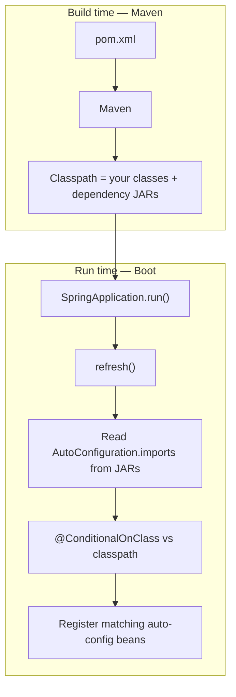

# Maven → Classpath → Auto-Configuration

**Remember:** Maven = **build time**. Spring Boot = **run time**. Boot never reads `pom.xml`.

---

## Full picture

```text
BUILD TIME (Maven)                         RUN TIME (Spring Boot)
─────────────────                          ──────────────────────
pom.xml
  │
  Maven reads file named pom.xml
  │
  Downloads JARs → ~/.m2
  Puts them on CLASSPATH
  │
  javac compiles your code
  │
  package (optional fat jar)
                    │
                    ▼  java -jar / IDE Run
              main() → SpringApplication.run()
                    │
         1. web type  2. create context  3. environment
                    │
         4. refresh()
              ├─ read AutoConfiguration.imports  (already inside JARs)
              ├─ @ConditionalOnClass  (is this class on CLASSPATH?)
              ├─ @ComponentScan + @Bean
              └─ create beans + start Tomcat
```



---

## 1. Maven (build)

| Fact | Detail |
|---|---|
| Input | File must be named **`pom.xml`** (or `mvn -f other.xml`) |
| Reads | dependencies, plugins, parent/BOM |
| Dependencies / JARs | Downloaded → **app classpath** |
| Plugins | Run **inside Maven** only — **not** on app classpath |
| Boot | Does **not** read `pom.xml` |

Starter vs normal JAR: both only put **classes on the classpath**. A starter is a shortcut POM (many JARs). Same classpath story.

---

## 2. Handoff

Classpath is the **bridge**.

```text
Maven finished  →  classpath is ready
Boot starts     →  looks at classes, not at pom.xml
```

---

## 3. Boot picks auto-config (inside `refresh()`)

`AutoConfiguration.imports` is **not** filled by your Maven. It is **already in the JAR** (Spring Boot team / library author, when **they** built that JAR).

On `refresh()`:

1. `@EnableAutoConfiguration` → `AutoConfigurationImportSelector`
2. Load **every** `META-INF/spring/org.springframework.boot.autoconfigure.AutoConfiguration.imports` on the classpath
3. For each listed class: `@ConditionalOnClass` / `@ConditionalOnMissingBean` / …
4. Match → register beans. No match → skip.

```text
JAR on classpath?  →  Maven’s job
Class Gson present? →  Boot condition
GsonAutoConfiguration in .imports? →  Boot team predefined it
```

---

## One sentence

**Maven reads `pom.xml` and builds the classpath; Boot at `refresh()` reads `AutoConfiguration.imports` from those JARs and creates beans only when the matching classes are on that classpath.**
