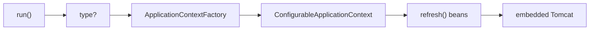

# Spring Boot Internals

**Goal:** explain `SpringApplication.run()` + `@SpringBootApplication` in ~2 minutes.

---

## 1. Where it starts

The class annotated with **`@SpringBootApplication`** is the entry point.

```java
@SpringBootApplication
public class Application {
    public static void main(String[] args) {
        ConfigurableApplicationContext ctx =
            SpringApplication.run(Application.class, args);
    }
}
```

`run()` returns **`ConfigurableApplicationContext`** (an `ApplicationContext`).

---

## 2. What `SpringApplication.run()` does

```text
main()
  └─ SpringApplication.run(App.class, args)
       1. Deduce WebApplicationType   →  NONE | SERVLET | REACTIVE
       2. ApplicationContextFactory.create(type)   ← Factory pattern
       3. Prepare Environment (profiles, yaml/properties, env vars)
       4. refresh() → register beans (scan + auto-config + @Bean)
       5. Start embedded server (Tomcat by default)
       6. Call ApplicationRunner / CommandLineRunner
```

| Step | Remember |
|---|---|
| Context type | Factory picks context from **web type** |
| `NONE` | No web (batch / CLI) |
| `SERVLET` | MVC + **embedded Tomcat** (default) |
| `REACTIVE` | WebFlux (Netty) |
| After refresh | Beans are ready → server starts |



---

## 3. `@SpringBootApplication` = 3 annotations

```text
@SpringBootApplication
   ├── @SpringBootConfiguration   → this is a @Configuration (primary source)
   ├── @EnableAutoConfiguration   → wire beans from starters on the classpath
   └── @ComponentScan             → find your @Component / @Service / ...
```

### `@SpringBootConfiguration`

- Specialized **`@Configuration`**.
- Tells Boot: *this class is the primary source for the application context*.

### `@EnableAutoConfiguration`

- Auto-config **starts here**.
- Starters in `pom.xml` land on the classpath.
- Boot 3 list of config classes:

```text
META-INF/spring/org.springframework.boot.autoconfigure.AutoConfiguration.imports
```

Only configs whose **conditions match** (class present, bean missing, etc.) are applied.

| Condition | Meaning |
|---|---|
| `@ConditionalOnClass` | Library is on the classpath (e.g. Tomcat, DataSource) |
| `@ConditionalOnMissingBean` | You didn’t already define that bean |
| `@ConditionalOnProperty` | A property is set / true |

**Boot 2** used `META-INF/spring.factories` → **Boot 3** uses `AutoConfiguration.imports`.

Skip one: `@SpringBootApplication(exclude = DataSourceAutoConfiguration.class)`.

### `@ComponentScan`

- Finds `@Component`, `@Service`, `@Repository`, `@Controller`.
- Scan root = **package of the `@SpringBootApplication` class + subpackages**.
- Uses classpath scan + reflection, then registers beans in the context.

**Interview trap:** put the main class in the **root package**, or child packages are never scanned.

---

## 4. Bean registration (two pipes)

```text
                    ApplicationContext
                   /                  \
     @ComponentScan                    @EnableAutoConfiguration
     (your code)                       (starter / Boot classes)
            \                          /
             └──── @Configuration @Bean ────┘
```

| Source | Example |
|---|---|
| Stereotype scan | `@Service class OrderService` |
| Auto-config | `DataSource`, `DispatcherServlet`, Tomcat |
| Explicit `@Bean` | methods on `@Configuration` |

---

## 5. 30-second pitch

> `run()` builds an `ApplicationContext` via a factory based on web type, refreshes it (scan + auto-config), then starts embedded Tomcat.  
> `@SpringBootApplication` is `@Configuration` + `@EnableAutoConfiguration` + `@ComponentScan`.  
> Auto-config reads `AutoConfiguration.imports` and applies classes only when `@ConditionalOn*` matches the classpath.

---

## Cheat card

| Ask | Answer |
|---|---|
| Entry | `@SpringBootApplication` + `SpringApplication.run()` |
| Return type | `ConfigurableApplicationContext` |
| Context created by | `ApplicationContextFactory` + `WebApplicationType` |
| Default server | Embedded **Tomcat** (Jetty / Undertow via starter swap) |
| Auto-config list | `AutoConfiguration.imports` (Boot 3) |
| Scan range | Main class package + below |
