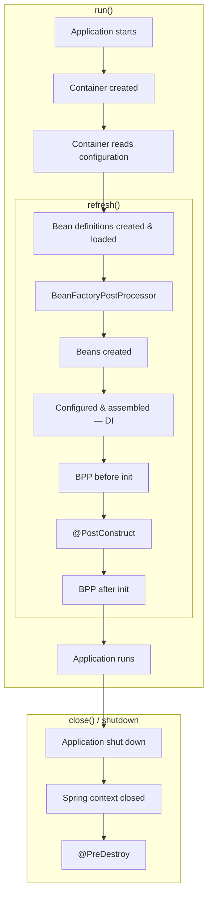
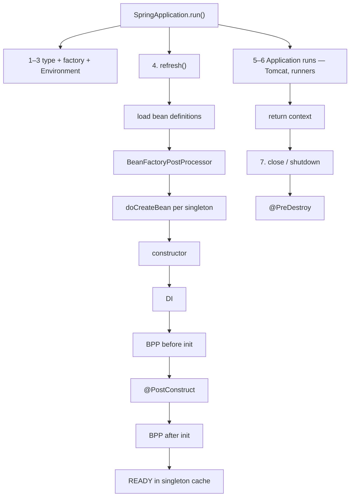

# Bean scope & lifecycle

**Demo:** [`bean-lifecycle-demo/DEMO.md`](bean-lifecycle-demo/DEMO.md)

---

## High-level flow

Boxes on the right = **`run()` / `refresh()` / `close()`**.

```text
 run()
 ┌─────────────────────────────────────────────────────────────┐
 │  Application starts                                         │
 │  Container created          (ApplicationContext)            │
 │  Container reads configuration  (scan, @Bean, auto-config)  │
 │                                                             │
 │   refresh()                                                 │
 │   ┌───────────────────────────────────────────────────────┐ │
 │   │  Bean definitions created & loaded                    │ │
 │   │  BeanFactoryPostProcessor (modify definitions)        │ │
 │   │  Beans created            (constructor)               │ │
 │   │  Beans configured & assembled  (DI)                   │ │
 │   │  BeanPostProcessor  before initialization             │ │
 │   │  @PostConstruct                                         │ │
 │   │  BeanPostProcessor  after initialization  (AOP proxy) │ │
 │   └───────────────────────────────────────────────────────┘ │
 │  Application runs           (runners, Tomcat, traffic)      │
 └─────────────────────────────────────────────────────────────┘

 close() / shutdown hook     ← not inside run()
 ┌─────────────────────────────────────────────────────────────┐
 │  Application shut down                                      │
 │  Spring context closed                                      │
 │  @PreDestroy                                                │
 └─────────────────────────────────────────────────────────────┘
```



| Stage | Happens in |
|---|---|
| Start, container, read config | **`run()`** (then into `refresh()`) |
| Definitions → BFPP → create → DI → BPP → `@PostConstruct` → BPP | **`refresh()`** inside **`run()`** |
| Application runs | End of **`run()`**, then process stays up |
| Shutdown, `close()`, `@PreDestroy` | **`close()`** / hook — **not** inside `run()` |

>> Note: `@PostConstruct` =  after objects are created by container & before going to give the object t use/call business function - if we want to perform some checks.
          `@PreDestroy` = before application context destroys & after objects have performed all the business function execution - if we want to perform some cleanup or close the resources.
---

## End-to-end picture (same flow — Boot steps & class names)

Detail of the High-level boxes. **Born in `refresh()`. Die in `close()`.**

```text
SpringApplication.run()
│
├─ 1. Deduce WebApplicationType (NONE / SERVLET / REACTIVE)
├─ 2. ApplicationContextFactory.create(type)     → container created
├─ 3. Prepare Environment (profiles, yaml, env)
│
├─ 4. refresh()
│     load bean definitions (scan, @Bean, auto-config)
│     BeanFactoryPostProcessor     ← modify definitions (not the instances)
│     then for each singleton:
│         DefaultListableBeanFactory
│           └── AbstractAutowireCapableBeanFactory.doCreateBean()
│                 4a. createBeanInstance()      constructor   = Beans created
│                 4b. populateBean()            DI            = assembled
│                 4c. initializeBean()
│                       BeanPostProcessor.beforeInit
│                       @PostConstruct
│                       BeanPostProcessor.afterInit  (AOP proxy)
│                 singleton cache → READY
│
├─ 5–6. Application runs — Tomcat (if web), ApplicationRunner
└─ return context
        │
        ─ ─ ─ run() has finished ─ ─ ─
        │
        7. close() / shutdown hook
              @PreDestroy
```



| Step | Inside `run()`? | What |
|---|---|---|
| 1–3 | Yes | Type, context, environment |
| **4 `refresh()`** | **Yes** | Definitions → BFPP → constructor → DI → `@PostConstruct` |
| 5–6 | Yes | Server, runners — app runs |
| **7 destroy** | **No** | **`@PreDestroy`** on close / Ctrl+C |

---

## 1. Scope — how many instances?

| Scope | Meaning | Typical use |
|---|---|---|
| **singleton** (default) | **One** instance per `ApplicationContext` | `OrderService`, repositories |
| **prototype** | **New** instance every `getBean` / inject | Stateful object (e.g. a cart being filled) |
| **request** | One per HTTP request | Web only |
| **session** | One per HTTP session | Web only |

```java
@Service                          // singleton
public class OrderService { }

@Component
@Scope("prototype")
public class Cart { }
```

### Prototype scenario (short)

`refresh()` stores only the **recipe** (Register the Bean Definition) for `Cart`. `new Cart()` runs on **`getBean(Cart)`** (or inject), not with the singletons.

```text
refresh()     OrderService created     Cart?  no
getBean()     new Cart()               each call → new object
close()       OrderService @PreDestroy Cart?  no — container forgot it
```

**Trap — inject prototype into singleton**

```java
@Service
public class OrderService {
    private final Cart cart;                 // ONE Cart, forever
    public OrderService(Cart cart) { this.cart = cart; }
}
```

Injection runs **once** (when `OrderService` is created). Every request shares that cart.

**Fix — ask each time**

```java
private final ObjectProvider<Cart> carts;

public void add(String item) {
    carts.getObject().add(item);            // NEW Cart each call
}
```

**`@Lookup`** — Spring implements this as `getBean(Cart.class)`:

```java
@Service
public abstract class OrderService {

    @Lookup
    protected abstract Cart createCart();

    public void add(String item) {
        createCart().add(item);             // NEW Cart each call
    }
}
```

| | Prototype |
|---|---|
| Created | On demand, not in `refresh()` with singletons |
| `@PreDestroy` | **Not** called by `close()` — **you** own the instance |
| Into a singleton | Snapshot — use `ObjectProvider` / `@Lookup` |


If nothing **injects** it and nobody calls **`getBean`**, Spring only **registers the definition**. No instance is ever created.

There is no `@Prototype` — use `@Scope("prototype")`.

**When we actually need it (real time)** — object must be **Spring-managed** (DI / AOP) **and** must **not share mutable state**:

| Use case | Why not singleton |
|---|---|
| **Shopping cart** (items list) | One cart would mix users |
| **Wizard / multi-step form** | Each user/session has its own fields |
| **Per-run job** (`ReportJob` + file path) | Each run its own state |
| **Not thread-safe client** you cannot rewrite | New instance per use |

Most Boot APIs: **stateless `@Service` = singleton**. Per HTTP request → `@Scope("request")`. Per-call data → local variable / DTO, not a bean.

---

## 2. Lifecycle — what happens to one bean

This is the **inner `refresh()` strip** from High-level (create → assemble → BPP → `@PostConstruct` → BPP).  
**BeanFactoryPostProcessor is not here** — it runs **once** on **definitions**, before any of these instances exist.

```text
instantiate (constructor)
    → inject deps (populate)
    → Aware callbacks (BeanNameAware, ApplicationContextAware, …)
    → BeanPostProcessor.beforeInit
    → @PostConstruct  /  InitializingBean.afterPropertiesSet()  /  init-method
    → BeanPostProcessor.afterInit   ← AOP proxies often wrap here
    → READY (in use)                ← High-level “Application runs”
    → @PreDestroy                   ← High-level close() box
```

**You usually write only:** constructor + DI + `@PostConstruct` / `@PreDestroy`.

---

## 3. Class architecture (who runs that)

```text
SpringApplication.run()
    └── ApplicationContext.refresh()
            └── DefaultListableBeanFactory   (the IoC container / BeanFactory)
                    └── AbstractAutowireCapableBeanFactory
                            getBean() → createBean() → doCreateBean()
```


| Class | Role | High-level step |
|---|---|---|
| `ApplicationContext` | IoC facade (`run()` returns this) | Container created |
| `DefaultListableBeanFactory` | Bean **definitions** + singleton **cache** | Definitions loaded |
| `BeanFactoryPostProcessor` | Change definitions **before** instances | BFPP box |
| `AbstractAutowireCapableBeanFactory` | **Creates** beans (`doCreateBean`) | Beans created / assembled |
| `BeanPostProcessor` | Around init (AOP, extra setup) | BPP before / after |

Singleton cache: after create, instance lives in the factory map. **Prototype** is not stored there.

---

## 4. Destroy

This is the High-level **`close()`** box. `refresh()` finished → bean in use. Destroy runs **during** `close()`, not before you call it and not after `close()` returns.

`DisposableBeanAdapter` → `@PreDestroy` → `DisposableBean.destroy()` → `destroy-method`.

Only for **singletons** the container tracks.

**`ctx.close()` is not mandatory** in a normal Boot app. Boot registers a **JVM shutdown hook**. Ctrl+C / SIGTERM / stop process → hook → `close()` → `@PreDestroy`.

| How it stops | `@PreDestroy` |
|---|---|
| Production web app — do **not** `close()` in `main` | Hook on process stop |
| Demo may `close()` | Yes — same run |
| Without `close()` in `main` | **Yes** on normal shutdown |
| Ctrl+C / `SIGTERM` (`kubectl delete`, rolling update) | **Yes** (grace period, then SIGKILL if too slow) |
| `System.exit(n)` | **Yes** — normal JVM shutdown, hook runs |
| `SpringApplication.exit(ctx)` | **Yes** — Boot closes, then exit |
| `Runtime.halt()` / `kill -9` | **No** |
| **Pod `OOMKilled`** | **No** — cgroup **SIGKILL**, like `kill -9` |
| JVM `OutOfMemoryError` (process still up) | **Unreliable** — JVM already sick |

Pod OOM: **no** SIGTERM first. Don’t rely on `@PreDestroy` to flush critical data.
`@PreDestroy` = polite goodbye on deploy/stop. Not a crash-recovery or OOM safety net.

---

## 30-second pitch

> Default scope is **singleton** — one per context. **Prototype** = new each ask. Create path is `BeanFactory.doCreateBean`: construct → inject → `@PostConstruct` → (optional proxy). Destroy is `@PreDestroy` on context close for singletons.
