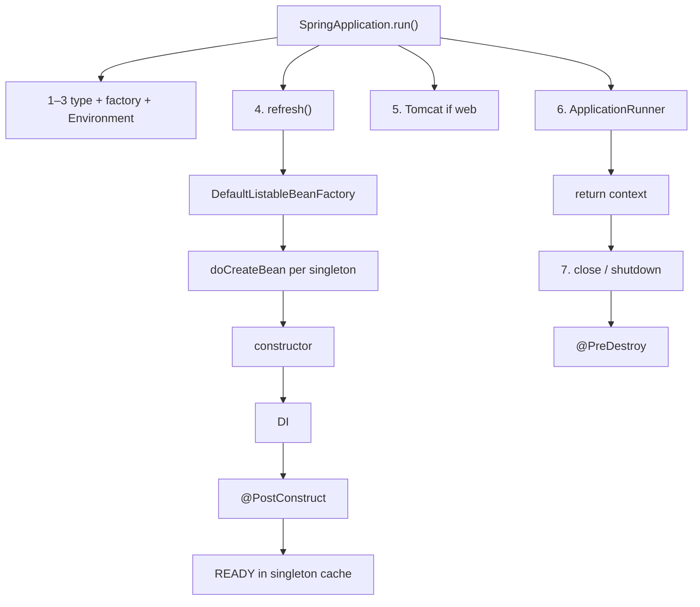
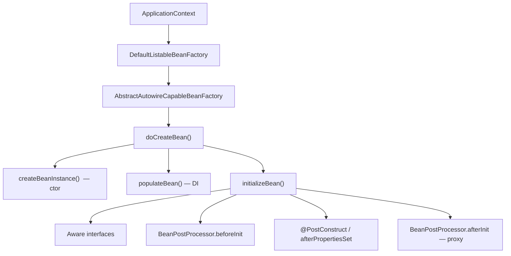

# Bean scope & lifecycle

**Demo:** [`bean-lifecycle-demo/DEMO.md`](bean-lifecycle-demo/DEMO.md)

---

## End-to-end picture (memorize this)

**Born in `run()` → `refresh()`. Die on `close()` / JVM shutdown — not inside `run()`.**

```text
SpringApplication.run()
│
├─ 1. Deduce WebApplicationType (NONE / SERVLET / REACTIVE)
├─ 2. ApplicationContextFactory.create(type)     → ConfigurableApplicationContext
├─ 3. Prepare Environment (profiles, yaml, env)
│
├─ 4. refresh()                          ★ beans are BORN here
│     ApplicationContext
│         └── DefaultListableBeanFactory
│                 └── AbstractAutowireCapableBeanFactory
│                         for each singleton:
│                           doCreateBean()
│                             4a. createBeanInstance()     ctor
│                             4b. populateBean()            DI (@Autowired)
│                             4c. initializeBean()
│                                   Aware interfaces
│                                   BeanPostProcessor.beforeInit
│                                   @PostConstruct
│                                   BeanPostProcessor.afterInit  (AOP proxy)
│                             put in singleton cache  → READY
│
├─ 5. Start embedded server (Tomcat) if SERVLET
├─ 6. ApplicationRunner / CommandLineRunner     ← after ALL singletons ready
└─ return context
        │
        ─ ─ ─ run() has finished ─ ─ ─
        │
        7. ctx.close()  or  JVM shutdown hook
              @PreDestroy   ★ beans DIE here (singletons only)
```



| Step | Inside `run()`? | What |
|---|---|---|
| 1–3 | Yes | Type, context, environment |
| **4 `refresh()`** | **Yes** | **ctor → inject → `@PostConstruct`** for singletons |
| 5–6 | Yes | Server, runners |
| **7 destroy** | **No** | **`@PreDestroy`** on close / Ctrl+C |

---

## 1. Scope — how many instances?

| Scope | Meaning | Typical use |
|---|---|---|
| **singleton** (default) | **One** instance per `ApplicationContext` | `OrderService`, repositories |
| **prototype** | **New** instance every `getBean` / inject | Stateful object (e.g. a cart being filled) |
| **request** | One per HTTP request | Web only |
| **session** | One per HTTP session | Web only |

```java
@Service                          // singleton
public class OrderService { }

@Component
@Scope("prototype")
public class Cart { }
```

### Prototype scenario (short)

`refresh()` stores only the **recipe** for `Cart`. `new Cart()` runs on **`getBean(Cart)`** (or inject), not with the singletons.

```text
refresh()     OrderService created     Cart?  no
getBean()     new Cart()               each call → new object
close()       OrderService @PreDestroy Cart?  no — container forgot it
```

**Trap — inject prototype into singleton**

```java
@Service
public class OrderService {
    private final Cart cart;                 // ONE Cart, forever
    public OrderService(Cart cart) { this.cart = cart; }
}
```

Injection runs **once** (when `OrderService` is created). Every request shares that cart.

**Fix — ask each time**

```java
private final ObjectProvider<Cart> carts;

public void add(String item) {
    carts.getObject().add(item);            // NEW Cart each call
}
```

(`@Lookup` does the same: method → `getBean(Cart.class)`.)

| | Prototype |
|---|---|
| Created | On demand, not in `refresh()` with singletons |
| `@PreDestroy` | **Not** called by `close()` — **you** own the instance |
| Into a singleton | Snapshot — use `ObjectProvider` / `@Lookup` |

---

## 2. Lifecycle — what happens to one bean

```text
instantiate (ctor)
    → inject deps (populate)
    → Aware callbacks (BeanNameAware, ApplicationContextAware, …)
    → BeanPostProcessor.beforeInit
    → @PostConstruct  /  InitializingBean.afterPropertiesSet()  /  init-method
    → BeanPostProcessor.afterInit   ← AOP proxies often wrap here
    → READY (in use)
    → @PreDestroy  /  DisposableBean.destroy()  /  destroy-method
```

**You usually write only:** constructor + DI + `@PostConstruct` / `@PreDestroy`.

---

## 3. Class architecture (who runs that)

```text
SpringApplication.run()
    └── ApplicationContext.refresh()
            └── DefaultListableBeanFactory   (the IoC container / BeanFactory)
                    └── AbstractAutowireCapableBeanFactory
                            getBean() → createBean() → doCreateBean()
```



| Class | Role |
|---|---|
| `ApplicationContext` | IoC facade (`run()` returns this) |
| `DefaultListableBeanFactory` | Holds bean **definitions** + singleton **cache** |
| `AbstractAutowireCapableBeanFactory` | **Creates** beans (`doCreateBean`) |
| `BeanPostProcessor` | Hook around init (AOP, `@Autowired` processing, etc.) |

Singleton cache: after create, instance lives in the factory map. **Prototype** is not stored there.

---

## 4. Destroy

`refresh()` finished → bean in use. Destroy runs **during** `close()`, not before you call it and not after `close()` returns.

`DisposableBeanAdapter` → `@PreDestroy` → `DisposableBean.destroy()` → `destroy-method`.

Only for **singletons** the container tracks.

**`ctx.close()` is not mandatory** in a normal Boot app. Boot registers a **JVM shutdown hook**. Ctrl+C / SIGTERM / stop process → hook → `close()` → `@PreDestroy`.

| | |
|---|---|
| Production web app | Do **not** `close()` in `main` (that would shut the app down) |
| Demo | May `close()` so `@PreDestroy` prints in the **same** run |
| Without `close()` in `main` | `@PreDestroy` **still runs** on normal shutdown |
| `kill -9` / crash | Hook does **not** run → no `@PreDestroy` |

---

## 30-second pitch

> Default scope is **singleton** — one per context. **Prototype** = new each ask. Create path is `BeanFactory.doCreateBean`: construct → inject → `@PostConstruct` → (optional proxy). Destroy is `@PreDestroy` on context close for singletons.
