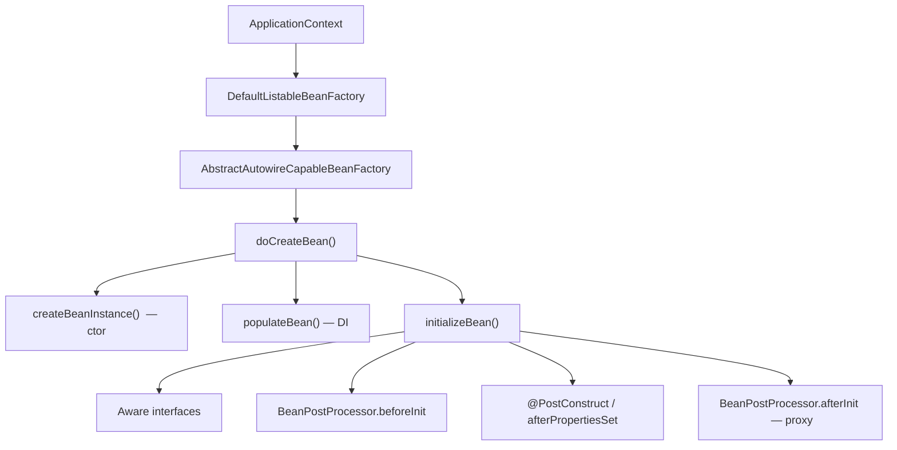

# Bean scope & lifecycle

**Demo:** [`bean-lifecycle-demo/DEMO.md`](bean-lifecycle-demo/DEMO.md)

---

## 1. Scope — how many instances?

| Scope | Meaning | Typical use |
|---|---|---|
| **singleton** (default) | **One** instance per `ApplicationContext` | `OrderService`, repositories |
| **prototype** | **New** instance every `getBean` / inject | Stateful object (e.g. a cart being filled) |
| **request** | One per HTTP request | Web only |
| **session** | One per HTTP session | Web only |

```java
@Service                          // singleton
public class OrderService { }

@Component
@Scope("prototype")
public class Cart { }
```

**Interview traps**

- Injecting **prototype into singleton**: the singleton gets **one** prototype at creation time — not a new one per call. Fix: `ObjectProvider<Cart>` / `@Lookup`.
- **Prototype `@PreDestroy` is not called** by the container (you own that instance).

---

## 2. Lifecycle — what happens to one bean

```text
instantiate (ctor)
    → inject deps (populate)
    → Aware callbacks (BeanNameAware, ApplicationContextAware, …)
    → BeanPostProcessor.beforeInit
    → @PostConstruct  /  InitializingBean.afterPropertiesSet()  /  init-method
    → BeanPostProcessor.afterInit   ← AOP proxies often wrap here
    → READY (in use)
    → @PreDestroy  /  DisposableBean.destroy()  /  destroy-method
```

**You usually write only:** ctor + DI + `@PostConstruct` / `@PreDestroy`.

---

## 3. Class architecture (who runs that)

```text
SpringApplication.run()
    └── ApplicationContext.refresh()
            └── DefaultListableBeanFactory   (the IoC container / BeanFactory)
                    └── AbstractAutowireCapableBeanFactory
                            getBean() → createBean() → doCreateBean()
```



| Class | Role |
|---|---|
| `ApplicationContext` | IoC facade (`run()` returns this) |
| `DefaultListableBeanFactory` | Holds bean **definitions** + singleton **cache** |
| `AbstractAutowireCapableBeanFactory` | **Creates** beans (`doCreateBean`) |
| `BeanPostProcessor` | Hook around init (AOP, `@Autowired` processing, etc.) |

Singleton cache: after create, instance lives in the factory map. **Prototype** is not stored there.

---

## 4. Destroy

`refresh()` finished → bean in use. On `context.close()` / JVM shutdown hook:

`DisposableBeanAdapter` → `@PreDestroy` → `DisposableBean.destroy()` → `destroy-method`.

Only for **singletons** the container tracks.

---

## 30-second pitch

> Default scope is **singleton** — one per context. **Prototype** = new each ask. Create path is `BeanFactory.doCreateBean`: construct → inject → `@PostConstruct` → (optional proxy). Destroy is `@PreDestroy` on context close for singletons.
